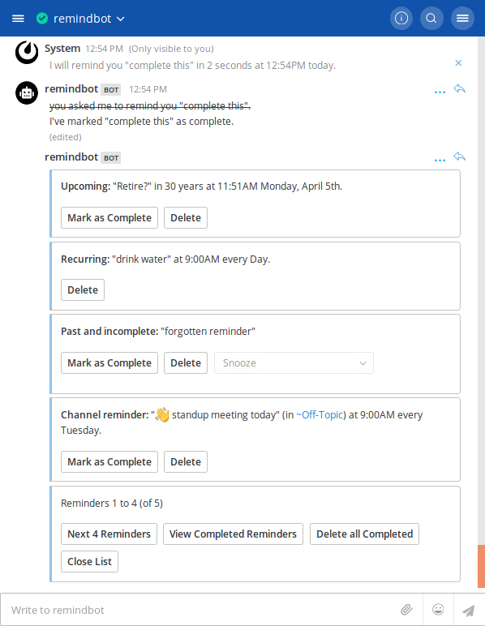

# mattermost-plugin-remind [](https://circleci.com/gh/scottleedavis/mattermost-plugin-remind/tree/master)  [](https://codecov.io/gh/scottleedavis/mattermost-plugin-remind)

_**A bot that schedules reminders for Mattermost**_



### Installation

_requires Mattermost 5.10 or greater_

1) Go to the [releases page](https://github.com/scottleedavis/mattermost-plugin-remind/releases) of this GitHub repository and download the latest release for your Mattermost server.
2) Upload this file in the Mattermost System Console > Plugins > Management page to install the plugin. To learn more about how to upload a plugin, see the documentation.
    
### Usage

See the full list of [Usage Examples](https://github.com/scottleedavis/mattermost-plugin-remind/wiki/Usage) in the [wiki](https://github.com/scottleedavis/mattermost-plugin-remind/wiki) 
* `/remind help`
* `/remind list`
* `/remind [who] [what] [when]`
  * `/remind [who] [what] in [# (seconds|minutes|hours|days|weeks|months|years)]`
  * `/remind [who] [what] at [(noon|midnight|one..twelve|00:00am/pm|0000)] (every) [day|date]`
  * `/remind [who] [what] (on) [(monday-sunday|month&day|m/d/y|d.m.y)] (at) [time]`
  * `/remind [who] [what] every (other) [monday-sunday|month&day|m/d|d.m] (at) [time]`
* `/remind [who] [when] [what]`

### Building 

#### Requirements
* [Go 1.12](https://golang.org/)
* [Dep](https://github.com/golang/dep)

```
make
```

This will produce a single plugin file (with support for multiple architectures) for upload to your Mattermost server:

```
dist/com.github.scottleedavis.mattermost-plugin-remind.tar.gz
```

There is a build target to automate deploying and enabling the plugin to your server, but it requires configuration as below:
```
export MM_SERVICESETTINGS_SITEURL=http://localhost:8065
export MM_ADMIN_USERNAME=admin
export MM_ADMIN_PASSWORD=password
make deploy
```
In production, deploy and upload your plugin via the [System Console](https://about.mattermost.com/default-plugin-uploads).

