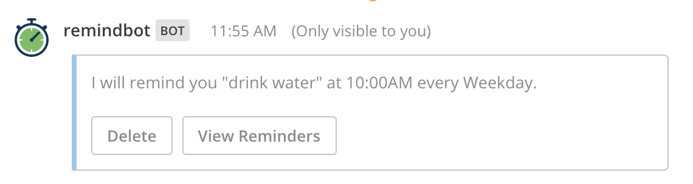

# Mattermost Plugin Remind

[](https://circleci.com/gh/scottleedavis/mattermost-plugin-remind)  [](https://codecov.io/gh/scottleedavis/mattermost-plugin-remind)  [](https://goreportcard.com/report/github.com/scottleedavis/mattermost-plugin-remind)  [](https://bestpractices.coreinfrastructure.org/projects/3119)  [](https://github.com/scottleedavis/mattermost-plugin-remind/releases/latest)

_**A bot that schedules reminders for [Mattermost](https://mattermost.com/)**_



### Installation

_requires Mattermost v6.5.2 or greater._

1) Go to the [releases page](https://github.com/scottleedavis/mattermost-plugin-remind/releases) of this GitHub repository and download the latest release for your Mattermost server.
2) Upload this file in the Mattermost System Console > Plugins > Management page to install the plugin. To learn more about how to upload a plugin, see the documentation.
3) For a better cross timezone experience, enable Experimental timezone support.  `System Console -> Experimental Features -> Timezone  = true`
4) (Opt.) If your server is not configured for cross-team DMs (i.e. `Enable users to open Direct Message channels with:` is set to `Users on same Team`) then you will need to add `remindbot` to any team which wishes to use the plugin. This is done through the "Manage members" interface.


### Usage

* `/remind` - opens up an [interactive dialog](https://docs.mattermost.com/developer/interactive-dialogs.html) to schedule a reminder
* `/remind help` - displays help examples
* `/remind list` - displays a list of reminders
* `/remind [who] [what] [when]`
  * `/remind [who] [what] in [# (seconds|minutes|hours|days|weeks|months|years)]`
  * `/remind [who] [what] at [(noon|midnight|one..twelve|00:00am/pm|0000)] (every) [day|date]`
  * `/remind [who] [what] (on) [(monday-sunday|month&day|m/d/y|d.m.y)] (at) [time]`
  * `/remind [who] [what] every (other) [monday,...,sunday|weekdays|month&day|m/d|d.m] (at) [time]`
* `/remind [who] [when] [what]`

Here is the full list of [Examples](https://github.com/scottleedavis/mattermost-plugin-remind/wiki/Usage)

### Build

```
make
```

This will produce a single plugin file (with support for multiple architectures) for upload to your Mattermost server:

```
dist/com.github.scottleedavis.mattermost-plugin-remind.tar.gz
```
