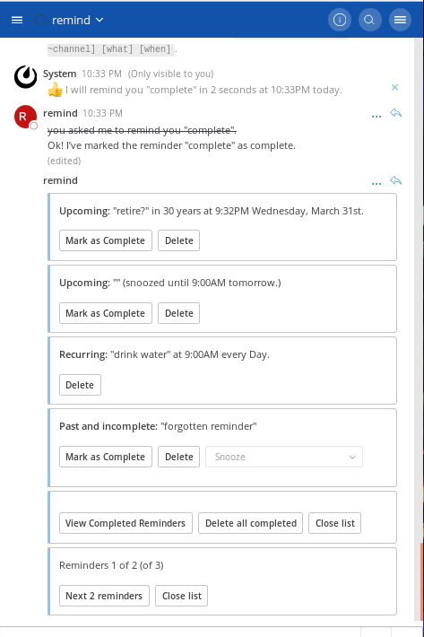

# mattermost-plugin-remind

### a plugin slashcommand bot that schedules reminders for Mattermost



### usage

See the full list of [Usage Examples](https://github.com/scottleedavis/mattermost-plugin-remind/wiki/Usage) in the [wiki](https://github.com/scottleedavis/mattermost-plugin-remind/wiki) 
* `/remind help`
* `/remind list`
* `/remind version`
* `/remind [who] [what] [when]`
  * `/remind [who] [what] in [# (seconds|minutes|hours|days|weeks|months|years)]`
  * `/remind [who] [what] at [(noon|midnight|one..twelve|00:00am/pm|0000)] (every) [day|date]`
  * `/remind [who] [what] (on) [(Monday-Sunday|Month&Day|MM/DD/YYYY|MM/DD)] (at) [time]`
  * `/remind [who] [what] every (other) [Monday-Sunday|Month&Day|MM/DD] (at) [time]`
* `/remind [who] [when] [what]`


#### requirements
* [Mattermost](https://mattermost.com/)
* [Go](https://golang.org/)
* [Dep](https://github.com/golang/dep)


### Building 
```
make
```

This will produce a single plugin file (with support for multiple architectures) for upload to your Mattermost server:

```
dist/com.github.scottleedavis.mattermost-plugin-remind.tar.gz
```

There is a build target to automate deploying and enabling the plugin to your server, but it requires configuration and [http](https://httpie.org/) to be installed:
```
export MM_SERVICESETTINGS_SITEURL=http://localhost:8065/
export MM_ADMIN_USERNAME=admin
export MM_ADMIN_PASSWORD=password
export HTTP=http
make deploy
```
In production, deploy and upload your plugin via the [System Console](https://about.mattermost.com/default-plugin-uploads).

