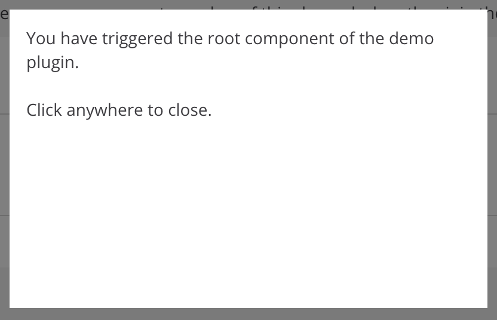
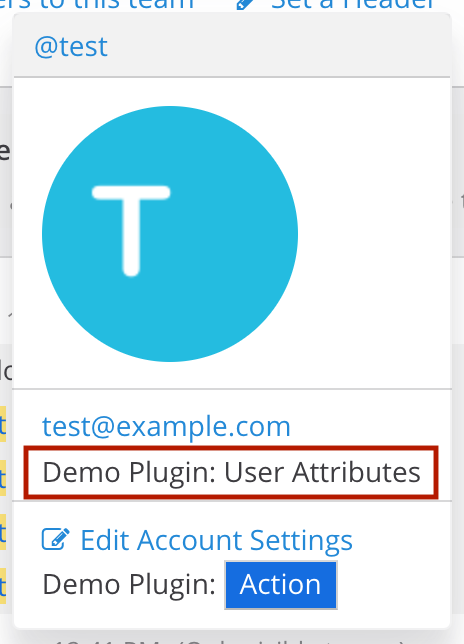
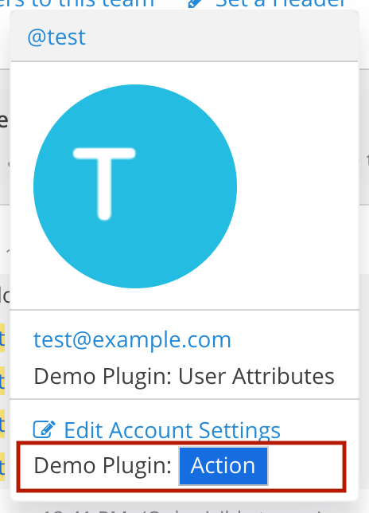
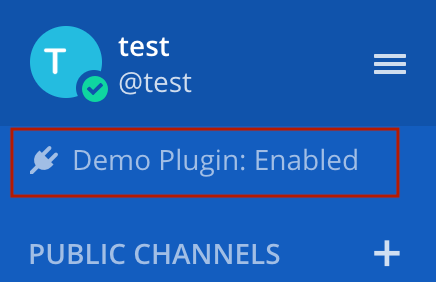
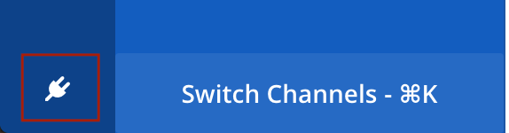
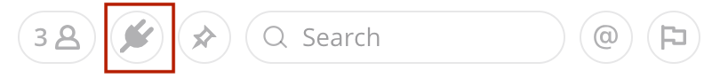
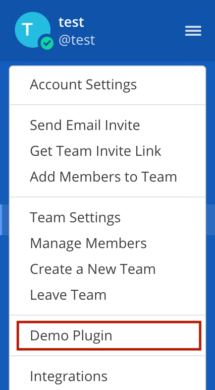
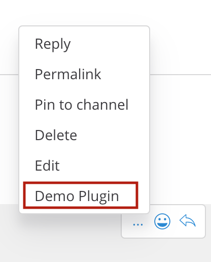
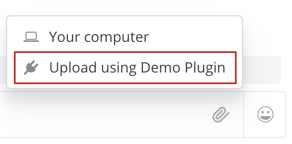
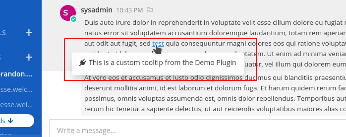

# Demo Plugin: Web App

The web app component of this demo plugin is written in Javascript, and leverages [React](https://reactjs.org/) and [Redux](https://redux.js.org/). It registers a component type for all of the supported registration calls, parses a custom webhook to detect when the server plugin's hooks status changes, and pings the server on network reconnect to synchronize state.

Each of the included files or folders is outlined below.

## [package.json](package.json)

See the NPM documentation on [package.json](https://docs.npmjs.com/files/package.json). It defines a `build` script to invoke webpack and generate a bundle, a `lint` script to run the `src/` directory through the [eslint](https://eslint.org/) checker, and a `fix` script that both lints and automatically tries to fix issues.

## [package-lock.json](package-lock.json)

See the NPM documentation on [package-lock.json](https://docs.npmjs.com/files/package-lock.json).

## [webpack.config.js](webpack.config.js)

See the Webpack documentation on [configuration](https://webpack.js.org/configuration/). Notably, this configuration specifies external dependencies on React, Redux and React Redux to avoid bundling these libraries and duplicating the versions already part of the Mattermost Web App.

## [.eslintrc.json](.eslintrc.json)

This defines rules to configure [eslint](https://eslint.org/) as part of invoking the `lint` and `fix` scripts. The styles are based on the rules used by the Mattermost Webapp.

## [node\_modules](node_modules)

This is the [location](https://docs.npmjs.com/files/folders#node-modules) in which [npm](https://www.npmjs.com/) installs any necessary Javascript dependencies.

## [src/index.js](src/index.js)

This is the entry point of the web app. When the plugin is loaded, this file is executed, registering the plugin with the Mattermost Webapp.

## [src/plugin\_id.js](src/plugin_id.js)

This is a file generated by the [build/manifest](../build/manifest) tool that captures the plugin id from [plugin.json](../plugin.json). It simplifies the need to hard-code the plugin id in multiple places by exporting a constant for use instead.

## [src/plugin.jsx](src/plugin.jsx)

This defines the Plugin class requires by the Mattermost Webapp, registering all the components and callbacks used by the plugin on `initialize` and logging a console message on `uninitialize`.

## [src/reducer.js](src/reducer.js)

This exports a [reducer](https://redux.js.org/basics/reducers) tracking the plugin hook's status. It is part of the global state of the Mattermost Webapp, and accessible at `store['plugins' + PluginId]`.

## [src/selectors.js](src/selectors.js)

This defines selectors into the Redux state managed by the plugin to determine if the plugin is enabled or disabled.

## [src/action\_types.js](src/action_types.js)

This exports constants used by the Redux [actions](https://redux.js.org/basics/actions) in [action\_types.js](src/action_types.js). It's important to namespace any action types to avoid unintentional collisions with action types from the Mattermost Webapp or other plugins.

## [src/actions.js](src/actions.js)

This exports Redux [actions](https://redux.js.org/basics/actions) for triggering the root component, as well as querying the server for the current plugin hooks status and responding to websocket events emitted by the server for the plugin.

## [components](components)

This folder exports a number of components illustrating plugin functionality.

## Root

This plugin registers a modal-like root component that displays above all other components, and is triggered by interacting with other plugin components on the page:

## User Attributes

This plugin registers a user attributes components displaying a static string:

## User Actions

This plugin registers a user actions components displaying a static string followed by a simple `<button>` that triggers the root component:

## Left Sidebar Header

This plugin registers a left sidebar header component displaying the current status of the plugin hooks:

## Bottom Team Sidebar

This plugin registers a bottom team sidebar component displaying a plugin icon:

## Channel Header Button Action

This plugin registers a channel header button action displaying a plugin icon that, when clicked, triggers the root component:

# Post Type

This plugin renders a custom post type as part of handling the `OnConfigurationChange` hook in the server, dumping the updated plugin configuration:

## Main Menu Action

This plugin registers a main menu action that, when clicked, triggers the root component:

## Post Dropdown

This plugin registers a post dropdown action that, when clicked, triggers the root component:

## File Upload

This plugin registers a file upload action that, when clicked, triggers the root component:

## Link Tooltip

This plugin registers a link tooltip component, whose content is fully customizable. It is displayed when the mouse cursor hovers over a link in a post.
